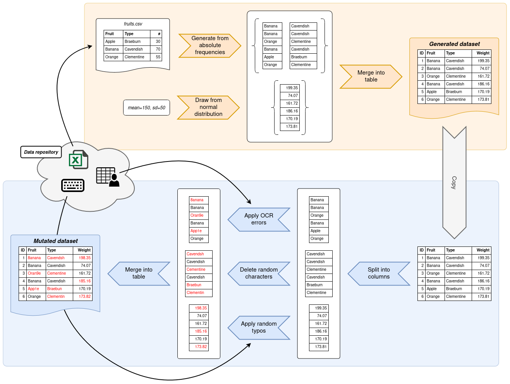

# Intro to Gecko

Gecko is a Python library for the bulk generation and mutation of realistic personal data.
It aims to be the bigger brother of the GeCo framework which was originally published by Tran et al. in 2013[^1].

Gecko brings a lot of quality-of-life and performance improvements over its predecessor.
It is backed by Numpy and Pandas which allows for easy integration into existing data science applications, as well as
massively improved performance by leveraging their vectorized functions wherever possible.

The aim of Gecko is to provide a library which allows for the creation of shareable Python scripts that generate
reliable and reproducible datasets.

## Installation

To get started, install Gecko using your preferred package management tool.

With pip:

```bash
pip install gecko-syndata
```

With Poetry:

```bash
poetry add gecko-syndata
```

## Overview

Writing a data generation script with Gecko is usually split into two consecutive steps.
In the first step, data is generated based on information that you provide.
Most commonly, Gecko pulls the information it needs from frequency tables, although other means of generating data
are possible.
Gecko will then output a dataset to your specifications.

In the second step, a copy of this dataset is mutated.
Gecko provides functions which deliberately introduce errors into your dataset.
These errors can take shape in typos, edit errors and other common data sources.
By the end, you will have a generated dataset and a mutated copy thereof.

<figure markdown>

<figcaption>How to work with Gecko</figcaption>
</figure>

Gecko is therefore composed of only two modules: `generator` and `mutator`.
They are responsible for &mdash; as their names imply &mdash; generating and mutating data respectively.
The `generator` module exposes generator functions which return data based on the information you provide them with.
The `mutator` module exposes mutator functions which take in data columns and perform mutations on them.

<figure markdown>

<figcaption>Gecko library overview</figcaption>
</figure>

Gecko makes heavy use of Pandas' core data types: series and data frames.
Basic familiarity with these data types helps with the adoption of Gecko, but is ultimately only useful if you intend
to use Gecko in a data science application where Pandas is already in heavy use.
In general, Gecko peruses series as columns containing data and data frames as tabular data containing one or more
series.

A generator is any function that takes in a number of values to create and returns a list
of [series](https://pandas.pydata.org/pandas-docs/stable/reference/series.html), where each series contains the desired
amount of generated values.
Generators are expressed by the following type alias.

## A simple example

If you haven't done so yet, install Gecko as described above.
For this example, we will use the [Gecko data repository](https://github.com/ul-mds/gecko-data) as a source of
information.
To make use of it, simply obtain a copy of it by cloning it.

```
$ git clone https://github.com/ul-mds/gecko-data.git
```

Create a new script next to the directory where you cloned the Gecko data repository to.
The following script generates a very simple dataset based on a frequency table of German given names and assigned
genders.
Once generated, the dataset is run through a couple generators that introduce random errors in the "gender"
column and swapped digits in the "age" column.
The generated and mutated dataset are then exported into CSV files.

_Tip: Click on the :material-plus-circle: icon in the code to get extra info on what a line of code does._

```python
from pathlib import Path

import numpy as np

from gecko import generator, mutator

rng = np.random.default_rng(727)  # (1)!
gecko_data_dir = Path(__file__).parent / "gecko-data"  # (2)!

df_generated = generator.to_data_frame(  # (3)!
    {
        ("given_name", "gender"): generator.from_multicolumn_frequency_table(  # (4)!
            gecko_data_dir / "de_DE" / "given-name-gender.csv",
            value_columns=["given_name", "gender"],
            freq_column="count",
            rng=rng,
        ),
        "age": generator.from_uniform_distribution(  # (5)!
            low=18, high=120, precision=0, rng=rng,
        ),
    },
    10_000,  # (6)!
)

df_mutated = mutator.mutate_data_frame(  # (7)!
    df_generated,
    [
        ("gender", (.01, mutator.with_categorical_values(  # (8)!
            gecko_data_dir / "de_DE" / "given-name-gender.csv",
            value_column="gender",
            rng=rng,
        ))),
        ("age", (.02, mutator.with_transpose(rng))),  # (9)!
    ],
    rng,
)

df_generated.to_csv("german-generated.csv", index_label="id")  # (10)!
df_mutated.to_csv("german-mutated.csv", index_label="id")
```

1. To get reproducible results, we need a random number generator (RNG) with a set seed. This guarantees that the output
   is always the same regardless of how many times the script is run.
2. This assumes that the Gecko data repository resides next to your script. If it doesn't, you need to adjust this path
   accordingly.
3. `to_data_frame` is one of Gecko's main helper functions. It allows you to map column names to generators and puts out
   a data frame according to your specifications.
4. To generate given names and associated genders, we use the corresponding frequency table from the Gecko data
   repository. The `from_multicolumn_frequency_table` generator needs to know where the frequency table is and what the
   value columns and the frequency column are called. Almost all generators and mutators also accept a `rng` argument
   which allows you to pass in your own RNG instance for predictable results.
5. To generate ages, we draw random numbers from a uniform distribution. This distributions has a lower limit of 18 and
   an upper limit of 120. To avoid floating point numbers, we set the precision to zero. Of course, in reality ages are
   never uniformly distributed. This is just for demonstration purposes.
6. We need to specify how many rows should be generated. 10,000 is a very conservative number for testing purposes. But
   since Gecko is built with performance in mind, why not try to add some more zeros to that number?
7. `mutate_data_frame` is another one of Gecko's main helper functions. It allows you to apply mutators to specific
   columns in a data frame.
8. If you have a look into the frequency table for given names and assigned genders, you'll notice there is a limited
   number of options for values that a person's gender can take on. This mutator looks at all possible values for the
   "gender" column and only replaces values with another random permitted value. Note the `.01` at the beginning. This
   denotes that 1% of all rows will be affected by this mutator.
9. For the "age" column, we want 2% of all values to have some of their digits flipped. This mutator selects neighboring
   characters at random and swaps them.
10. Once we got both our datasets, we can export them using Pandas' `to_csv` function. Since Gecko's helper functions
    return plain data frames, anything you can do with Pandas will also work with anything Gecko produces.

## What's next?

This has been a brief overview of Gecko and its features.
The remainder of this documentation provides a deep dive into the `generator` and `mutator` modules.
For a more hands-on approach, check out [some of the examples](examples/german.md).

[^1]: See: Tran, K. N., Vatsalan, D., & Christen, P. (2013, October). GeCo: an online personal data generator and
corruptor. In *Proceedings of the 22nd ACM international conference on Information & Knowledge Management* (pp.
2473-2476).